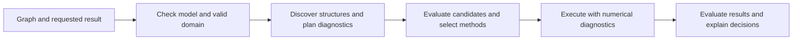
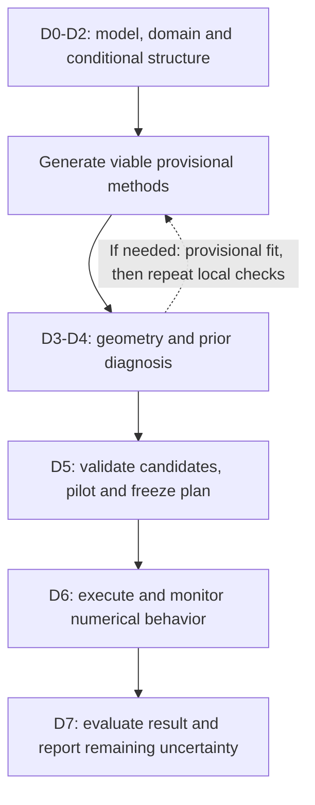

# Block inference: structure, solvers and approximation policy

> **文档状态：`plan-active`** · Block-methodology design and implementation inventory. PosteriorTask implements bounded preflight, initialization, stopping and bounded Gaussian proposal/MH composition, including automatic selection for supported moving-noise Gaussian blocks; broader discovery remains planned. Subordinate to the top-level design; index: docs/README.md.

**Date:** 2026-09-08. **Scope:** how a graph becomes parameter blocks, how each block receives a method, and how the result explains those decisions. This document carries the proposed decisions for this change. It does not replace the [top-level design](2026-08-30-bayesmith-top-level-design.md) or label existing executors as newly implemented.

**Reading guide:** Sections 1–3 explain the approach. Section 4 works through the multiplicative model. Section 5 separates model structure and prior choice. **Section 6 shows the diagnostic steps, their consequences, and a 500-parameter walkthrough.** Sections 7–8 inventory the implementation and remaining work. Section 9 defines acceptance criteria.

## 1. The design in one page

**Iterative GLS and bias-corrected log-space linearization should be explicit, selectable methods.** The compiler should discover their applicability and show them as candidates, even when an exact Gaussian posterior update is unavailable.

Five decisions must remain separate:

| Decision | Question | Example |
|---|---|---|
| Conditional structure | How does this block affect each factor, holding other parameters fixed? | `p_n` is affine in `mu`; `p_g` is affine in `log(mu)`. |
| Noise and prior | What prevents a closed-form conditional? | Noise changes with `p_n`; a positive prior may be non-Gaussian. |
| Requested result | Do we want a point, an original-target posterior, or an approximate posterior? | A GLS fixed point is a useful point estimate. |
| Numerical method | Which solver or proposal exploits the structure? | CG/Wiener solve, iterative GLS, corrected log-space WLS. |
| Correction and validation | What establishes the result's statistical meaning? | No correction for an exact conditional; MH for a proposal; explicit surrogate identity for an approximation. |

This replaces a misleading chain of reasoning: failure of an exact Gaussian route must not erase a linear mean structure. Likewise, recognizing a linear mean must not imply that its posterior is Gaussian.

The proposed workflow is:



**Proposed default:** preserve the original statistical target. Approximate calculations are still available as proposals. An explicitly requested fast estimate or approximate posterior may use them without an original-target correction, with the resulting object labeled accordingly. Selecting a mode is ordinary task configuration, not an interactive approval at every block.

## 2. The leading log bias can be removed

Write the multiplicative noise as

\[
y_i=\mu_i(1+w_i),\qquad w_i=f_i\epsilon_i,\qquad \epsilon_i\sim N(0,1).
\]

For small, known, parameter-independent `f`, the expansion is

\[
\log(1+w)=w-\tfrac12w^2+\tfrac13w^3-\cdots.
\]

Its Gaussian-moment expansion gives

\[
E[\log(1+f\epsilon)]
\sim-\tfrac12f^2-\tfrac34f^4+O(f^6),
\qquad
\operatorname{Var}[\log(1+f\epsilon)]
\sim f^2+\tfrac52f^4+O(f^6).
\]

**Subtracting the leading negative bias means adding `f²/2` to the log data:**

\[
z_i=\log y_i+\tfrac12f_i^2,
\qquad z_i\approx N(\log\mu_i,f_i^2).
\]

This is already the arithmetic in [`multiplicative_log_data`](../../../src/bayesmith/exact/loglinear.py). It should be offered as a method, not hidden behind a generic “not exact” rejection.

For the demo's `f = 0.001`:

| Quantity | Small-noise expansion |
|---|---:|
| Bias correction added to `log(y)` | `5 × 10⁻⁷` |
| Next residual mean term after that correction | `−7.5 × 10⁻¹³` |
| Leading relative correction to the log-noise variance | `2.5 × 10⁻⁶` |

These are asymptotic terms, not a measured global error certificate. They explain why this is a useful approximation. Removing the leading bias does not also remove higher moments, skewness or every accumulated inference error.

The expansion is on the positive-data domain. An untruncated Gaussian `epsilon` has a negative-data tail of probability `Phi(−1/f)`; the real logarithm does not exist there. The implementation must record positivity/domain checks and never silently clip or drop those data. Higher-order moments above are a small-noise expansion of the positive bulk, not an assertion that the unconditional real logarithm exists.

The current transform uses `FIRST_ORDER_MAX_FRACTIONAL = 0.06`, with a measured variance-error rationale in its source. Keep that existing policy in one owner. The new design adds an explicit approximation record and optional calibration against the original likelihood; a per-observation cutoff alone does not certify every dataset size or parameter geometry.

Further rules:

- For non-Gaussian `w`, use its actual moments; the coefficients above assume Gaussian noise.
- If fractional noise depends on parameters, its bias and variance must be evaluated with those parameters. Pre-correcting the data once may no longer be valid or produce a log-affine block.
- Correlated fractional noise retains a covariance in log space. A diagonal approximation requires its own declaration and validation.
- An actual LogNormal observation law has an exact Gaussian log representation. That is a different case from approximating a multiplicative Normal law. [Distribution definition](https://mc-stan.org/docs/2_24/functions-reference/lognormal.html).

## 3. Basic methods: specify the output before selecting a method

Names marked **proposed** describe capabilities, not callable APIs that already exist.

**Notebook grouping:** the eight numbered cards are **Basic methods / 基础方法**.
Cards **5 / 6 / 7 / 8** carry the same **Methods with proposals / 含提议机制的方法**
badge alongside the title, with a teal accent. Cards 5 (iterative GLS), 6 (bias-corrected log-linear)
and 7 (local linearization) can construct proposals; card 8 supplies correction.
Alternatively, importance reweighting is supported on eligible routes, with known
source density, retained weights and weight diagnostics.
A point solve alone is not a proposal: the construction must support random
draws and evaluation of the actual proposal density, including required reverse
densities, support handling and coordinate Jacobians. The solves may also be
used independently for point estimates or approximations. All three Gaussian
proposal adapters are implemented on the explicit bounded dense route in Section 6.9;
the badge alone does not claim that a saved demo selected that route.

The sidebar puts **Verified with demos** and its example navigation above the
design and assistance credits. The assistance credit reads **OpenAI Academic
Researcher and all developers who have contributed to humanity’s knowledge base**
(**OpenAI Academic Researcher 以及曾向人类知识库做出贡献的所有开发者**).

The compact notebook says **linear (allowing a fixed offset)** for `Xβ + r`;
the precise mathematical term is affine. The detailed reference retains the
mathematical distinction. Systematic discovery follows graph dependencies,
operator declarations and automatic-differentiation probes of means, log means
and covariances, including mixed derivatives before merging candidate blocks.
Finite probes remain evidence rather than a global proof.

| Method family | Useful structure | What it returns / targets | Required qualification |
|---|---|---|---|
| Wiener/GLS with fixed covariance | Affine mean and quadratic penalty give a GLS calculation | Conditional mean/mode and GCR draws when the full conditional is Gaussian; otherwise a point/proposal calculation | For Gaussian claims: the full conditional log density is quadratic, precision is positive definite on the sampled coordinates, and support is Gaussian-compatible; fixed covariance alone is insufficient |
| Iterative GLS | Affine mean, covariance changes with parameters | A reweighted GLS fixed point | Convergence of both inner solves and outer reweighting; not automatically full-likelihood MAP |
| Bias-corrected log-space solve | Log-affine mean, small multiplicative fractional noise | Approximate conditional point, Gaussian approximation, or proposal | Bias order, covariance approximation, positive domain and prior treatment recorded |
| Exact log-space GCR | Gaussian log observation law and quadratic conditional log density | Exact conditional draw in a transformed representation | Exact transformation, all factors included, valid support |
| Corrected structured proposal | Linear, log-linear or locally linear calculation is cheap | Original-target MCMC using MH; or weighted approximation using importance sampling | Correct full target and forward/reverse proposal densities; numerical and statistical diagnostics |
| Local linearization / Gauss–Newton | Smooth nonlinear block | Optimization step, local uncertainty or proposal | Declared expansion point and trust region; not a claim of global affinity |
| NUTS / other supported residual backend | Differentiable target without a preferable structured update | MCMC for the specified target | Support, convergence and backend applicability |
| Exact elimination / collapse | Integrable conditional structure | Reduced target and reconstruction law | Complete normalization and valid integral; covariance must satisfy elimination assumptions |

For finite discrete variables or linear Gaussian chains, existing enumeration and chain machinery can supply additional candidates. They follow the same factor-coverage and target rules; this design does not introduce new generic backends.

### 3.1 Three result modes

| Proposed mode | What the user requests | How approximations are used | Result meaning |
|---|---|---|---|
| **Fast estimate** | A reproducible, inexpensive fitted point | Iterative GLS and bias-corrected log-space solves may alternate directly | Proposed extension of `PointEstimateResult` with a typed estimator identity, fixed-point diagnostics and original-objective evaluation |
| **Original-target posterior** | Inference under the declared likelihood and prior | Structured approximations generate proposals; exact conditionals need no statistical correction | `PosteriorResult` for the original target, subject to numerical and Monte Carlo diagnostics |
| **Approximate posterior** | Inference under a named approximation | Construct one explicit surrogate joint density and use compatible methods for all blocks | `PosteriorResult` with surrogate identity, approximation record and comparison to the original target |

The current [`Estimand`](../../../src/bayesmith/artifacts/tasks.py) only permits `posterior_mean` and `map`. A generic GLS fixed point fits neither label. Exposing the fast-estimate mode therefore requires a typed protocol extension before it can be serialized as a task result; a free-text method name must not disguise it as MAP. Explicit MLE task labeling also needs protocol support.

A fourth use does not need another posterior mode: use fast estimates as initial values or preconditioners for original-target MAP/MLE optimization. The optimizer then checks the **full** objective and its optimality conditions. A raw alternating GLS/log-WLS fixed point must retain its estimator name; its convergence alone does not establish a MAP optimum or monotonic coordinate ascent.

#### Unbiasedness and MAP are different questions

With fixed full-rank design, fixed weights and mean-zero errors, unpenalized GLS
is unbiased. Estimated weights generally lose the finite-sample guarantee, and a
Gaussian prior adds shrinkage. An unbiased estimating equation does not imply an
unbiased estimator. [GLS / FGLS reference](https://www.mathworks.com/help/econ/fgls.html).

For independent `y_i ~ Normal(μ, f²μ²)` with known `f > 0`, unconstrained iterative
GLS immediately returns `mean(y)`, an unbiased estimator. The full Gaussian MLE
instead solves `f² μ² + mean(y) μ − mean(y²) = 0` for the positive root. Even on
datasets with positive sample mean, those two answers generally differ. The
unconstrained sample mean can be nonpositive; imposing positivity removes that
unbiasedness guarantee. For `n > 1` and nonzero data, a flat prior on `μ > 0`
gives a proper posterior whose MAP is the positive MLE. Thus outer convergence
alone is not the missing MAP condition: the objective must also include
covariance derivatives, including the likelihood normalization.

### 3.2 One posterior run needs one target

For an original target `pi`, a proposal for block `b`, holding the complement `c` fixed, can be accepted with

\[
\alpha=\min\left(1,
\frac{\pi(b',c)q(b\mid b',c)}{\pi(b,c)q(b'\mid b,c)}\right).
\]

The proposal can use iterative GLS or bias-corrected log linearization. If its construction depends on the current block value, the reverse proposal must be rebuilt appropriately. Proposal normalization, coordinate Jacobians and support cannot be omitted. The usual MH target-invariance argument applies only to the actual implemented kernel; finite-solve errors and sampling diagnostics remain separate. [Hastings, 1970](https://probability.ca/hastings/hastings.pdf).

In particular, the accepted probability flow is

\[
\pi(b,c)q(b'\mid b,c)\alpha(b,b')=
\min\{\pi(b,c)q(b'\mid b,c),\pi(b',c)q(b\mid b',c)\}.
\]

Exchanging b and b′ leaves this expression unchanged. Rejections supply the
remaining stay-put probability, so each block kernel preserves the conditional
and joint targets; their sequential composition preserves the joint target.
Convergence from an arbitrary starting point additionally needs appropriate
ergodicity conditions. One MH step is not an independent conditional draw.
After rejection retain that block's value and continue the configured schedule,
without undoing earlier block updates. Rejections count as updates, including
in any fixed number of inner MH steps. Store every retained sweep's full state,
including repeats; never substitute retry-until-accept for this kernel.

**MH and SNIS have different roles.** MH corrects transitions inside the Gibbs
sweep. SNIS corrects estimates from a known source density q, retaining weights
proportional to pi/q. Weights may be computed online, but attaching a weight to
an approximate block draw does not turn it into a valid Gibbs update. Reweighting
complete states requires their known joint source density; independently
constructed approximate conditionals need not define such a density. More
specialized weighted or particle transitions require their own kernel and proof.

Record proposal construction time separately from target/proposal evaluation
time. Rebuilding a GLS or local fit may dominate the cost, especially if a
state-dependent reverse proposal needs a second fit. Reuse factorizations only
where the actual proposal definition permits it, and compare effective samples
per second rather than acceptance alone.

For an approximate posterior, define `tilde_pi` once. For example, use the corrected log-Gaussian observation model for the entire graph. Every block then updates against `tilde_pi`; a difficult block can use MH or NUTS **on that surrogate**.

**Do not claim a known joint posterior by combining an uncorrected approximate log-Gaussian update for one block with an original-likelihood update for another.** Separate conditional approximations need not be compatible with any specified joint density. A fast point-estimation sweep is still useful, but that does not establish a posterior sampler. Approximation permission does not waive this distinction.

## 4. Worked design: exponential gain times a linear signal

\[
\mu=\exp(Up_g)\odot(Ap_n),\qquad \sigma=0.001\mu.
\]

The intended structural partition has two parameter groups:

| Block | Conditional relationship | Prior-independent structural conclusion |
|---|---|---|
| Gain parameters `p_g` | `log(mu) = U p_g + log(A p_n)` | Log-affine while `A p_n > 0` |
| Signal parameters `p_n` | `mu = M p_n`, `M = diag(exp(U p_g)) A` | Affine while holding `p_g` fixed |

They are not jointly affine. Their cross-dependence is a reason to consider alternating blocks, joint updates or valid elimination, rather than merging all individually affine candidates and abandoning them when the joint check fails.

The exponential makes the gain log-affine in `p_g`; it does not assign a LogNormal distribution to `p_g`. Also check identifiability before interpreting recovery: if a direction `v` satisfies `U v = 1`, shifting `p_g` by `c v` and scaling `p_n` by `exp(-c)` leaves `mu` unchanged. Flat priors cannot resolve that likelihood degeneracy; it requires an identifying constraint or suitable prior information.

### 4.1 Fast-estimate option

For Gaussian `p_g ~ N(m_g, P_g⁻¹)`, form

\[
r_g=\log y+\tfrac12f^2-\log(Ap_n),\qquad
(U^T W_g U+P_g)\widehat p_g=U^T W_g r_g+P_gm_g,
\quad W_g=\operatorname{diag}(f^{-2}).
\]

For a Gaussian penalty on `p_n`, an iterative-GLS step is

\[
(M^T W_k M+P_n)p_n^{k+1}=M^T W_k y+P_nm_n,
\qquad W_k=\operatorname{diag}\bigl((fMp_n^k)^{-2}\bigr).
\]

Alternate the gain solve and the signal reweighting, updating each block's conditioning values. Record the outer fixed-point change, inner solver residual, domain validity and the full original objective. Damping or a trust region may be needed. The two estimating equations are not automatically coordinate optimizers of one joint objective.

For a flat prior, set the corresponding precision to zero when the conditional system is identifiable. For strict positivity, use an appropriate constrained point solver; if the unconstrained solution is inside the feasible domain, it also solves that convex fixed-weight subproblem. For a LogNormal prior, keep the original non-quadratic penalty: use a constrained/nonlinear conditional optimizer or a clearly identified local approximation to that penalty.

### 4.2 Posterior options

| Goal | `p_g` block | `p_n` block | Common target |
|---|---|---|---|
| Original-target posterior, explicit bounded structured sweep | Bias-corrected log-space Gaussian **proposal + MH** | GLS-based **proposal + MH** | Original multiplicative-Normal likelihood and original priors |
| Approximate posterior | Log-space Gaussian conditional if the prior permits it; otherwise a compatible corrected update | Solver/sampler for the surrogate's nonlinear `log(A p_n)` dependence | Explicit corrected log-Gaussian surrogate and original priors |
| Original-target reference | Joint or blocked NUTS where supported | Same run | Original model |

The original-space iterative-GLS update is not an exact conditional of the log-space surrogate. It may help construct its proposal or initializer, but any required correction then uses the surrogate target.

The two-MH-block sweep is implemented through explicit `PosteriorTask` proposal
policies with dense work budgets, as described in Section 6.9. It is separate from
`sample_factors`. The bounded automatic selection described in Section 6.10
also selects this split for the registered small multiplicative demo when its
structure, domain and work-budget checks pass; unsupported cases retain NUTS.

### 4.3 What changes at 500 positive signal coefficients?

The structure remains `p_g: log-affine`, `p_n: affine`. Dimension affects cost, conditioning and mixing; it does not make the affine map nonlinear or mandate NUTS.

Keep the 500-dimensional signal as a vector block when the operator supports it. Apply `M`, `M.T` and covariance actions without forming dense 500-by-500 matrices by default. Splitting into 500 scalar updates is a separate candidate, justified only by conditional sparsity or measured mixing. Cost comparison should include operator timing, inner iterations, memory, cross-block coupling and proposal acceptance.

A measured conditional check in this checkout fixed `p_g` at its generating value: 500-dimensional iterative GLS converged in five reweightings and agreed with an independent normal-equation solver to about `3.3e-10` in the largest coordinate difference. This establishes a conditional solver capability, not joint posterior recovery or a general runtime advantage.

## 5. Discover structure before checking solver eligibility

For each proposed block, gather **every joint-density factor involving it**: its prior, observations, descendant latent distributions, joint priors and reduced-graph factors. The relevant conditional is the product of all those factors, not only observed-node likelihoods.

The analysis record should have separate entries for:

| Property | Examples of values |
|---|---|
| Mean structure | Affine, log-affine, locally linearizable, nonlinear |
| Covariance dependence | Fixed with respect to this block; changes only with the complement; changes with the block |
| Prior / other factors | Quadratic, flat, non-quadratic, hierarchical contribution |
| Domain | Real, positive, bounded; validity of each transformation |
| Evidence strength | Operator identity, numerically supported, numerically unresolved, disproved, outside valid domain |
| Solver eligibility | Exact conditional, constrained solve, approximate solve, evaluable proposal, residual backend |

A Gaussian prior makes a particular solver available. A non-Gaussian prior changes that solver's eligibility, not the mean-structure classification. A proposal metric derived from an approximate prior curvature must be recorded as a proposal construction, not as a replacement prior in the Graph.

Probe anchors and scales must be separate from prior definitions. Flat priors have no characteristic width; a valid initial point, a coordinate scale or a domain-aware probe specification can supply numerical analysis information without inventing a proper prior. Positive-domain models must not be judged solely at the invalid point zero.

Prefer compositional identities for operators whose mathematical contracts are known, supported by independent property checks. Function names alone are not evidence. For arbitrary Python operators, numerical checks provide evidence over recorded points and scales, not a proof over the entire domain. Preserve an unresolved numerical result rather than relabeling it nonlinear or widening the tolerance until it passes.

Grouping follows structural compatibility first and mixing considerations second. For sufficiently smooth individually affine maps, pairwise cross-dependence determines joint affinity; the current factor strategy uses pairwise tests and deterministic first-fit grouping. Numerical probes remain finite evidence, and greedy grouping need not minimize block count or runtime.

Hierarchy illustrates why factor coverage matters: `p_g -> latent field -> observation` can give a Gaussian hyperparameter conditional through the latent field even though an observed-only builder misses it. An ancestry exclusion in the current implementation should become a named capability limitation, while richer candidates include the latent's density explicitly.

### 5.1 User priors remain authoritative; diagnosis still runs

**The user declares the prior in the Graph.** Automatic partitioning chooses computational blocks and methods; it does not choose a different scientific prior. An explicit flat prior is also a declaration, not permission for the compiler to insert another prior.

The proposed analysis runs even when every prior is supplied. It reports three distinct questions:

| Check | User-facing conclusion |
|---|---|
| Structural and numerical eligibility | “The mean is affine, but this prior is non-quadratic: an exact Gaussian draw is unavailable; these solver/proposal alternatives remain.” |
| Statistical diagnosis | “This likelihood direction is weakly identified at the checked points,” or “this supported prior-sensitivity calculation moves the fitted point by this amount.” Report coverage and unresolved cases. |
| Task validity | “This evidence task lacks a normalized prior,” or “this declared support makes the requested transformation invalid.” A task may be refused without changing its model. |

Current compilation already records eligibility/refusal reasons. The more complete separation of structure from prior eligibility is proposed work. Existing `identifiability(...)` and `prior_sensitivity(...)` are explicitly invoked diagnostics, not automatic steps in every `compile_task` call. The latter currently requires selected diagonal Gaussian priors with parameters fixed under that selection; it is not an arbitrary-prior sensitivity audit. Neither a local rank check nor a successful fit proves posterior propriety.

### 5.2 Jeffreys is an explicit prior option, not an automatically required repair

Jeffreys' rule constructs a density proportional to `sqrt(det I(theta))` on a specified parameter space. Whether to adopt that prior is a modeling decision. A varying Fisher matrix, a nonlinear parameterization or weak identification does not by itself imply that Jeffreys is necessary. Prior choice belongs in the context of the likelihood and the intended analysis. [Gelman, Simpson and Betancourt, 2017](https://arxiv.org/abs/1708.07487).

The proposed system may report a Jeffreys candidate's scope, information rank, parameter dependence, equivalence to a declared flat density, and supported sensitivity comparisons. It must distinguish **applicable**, **redundant**, **undefined at checked points**, and **unresolved** from any scientific recommendation. It must not silently add or substitute the candidate. Fisher singularity is a reason to diagnose/reparameterize the model, not evidence that a Jeffreys determinant will repair it.

An explicitly selected Jeffreys policy may request automatic construction and checks for a user-named parameter scope. A conflict with an existing prior is reported; it is not silently resolved by multiplication or replacement. Checking compliance with a user-selected policy is different from discovering a universal requirement to use that policy.

For this document's independent multiplicative-Normal observations, known constant `f`, positive `A p_n`, and fixed `p_n`, the gain block has

\[
I_g=(f^{-2}+2)U^T U.
\]

The `f⁻²` term comes from mean information and the `2` term from parameter-dependent variance. If `U` has full column rank, this matrix is constant in `p_g`, so the conditional Jeffreys density is flat in `p_g`. It adds no shape correction to an already flat `p_g` prior. This is an analytic conclusion for this conditional model, not a new measured compiler feature or a statement about the full joint Jeffreys prior over `(p_g, p_n)`.

The prior's declared parameter scope must not follow later computational regrouping. Jeffreys priors constructed separately on conditional blocks are not generally the full-space Jeffreys prior. Repartitioning an execution plan must preserve the original joint density.

**Implemented bounded per-block diagnostic policy:** assess Jeffreys-versus-flat applicability for every computational block, independently of its selected method. Name the likelihood, parameter coordinates, complement held fixed and domain. A conservative primal Jaxpr certificate establishes affine Gaussian means and block-independent complete covariance descriptors; full numerical rank and compatible probes are also required for a flat verdict. Other supported programs retain numerical determinant comparisons. Custom or stopped derivatives and unsupported operations cannot establish numerical rank or flatness; measured values remain evidence with an unresolved verdict. Unsupported or over-budget checks remain visible. This conditional comparison does not construct a new joint prior: the user-specified prior remains in every update. Actually adopting Jeffreys still requires an explicit prior declaration on a user-named scope.

**Timing:** perform this form/applicability analysis before warmup, using domain-valid initialization or analysis points where needed. It is not a diagnostic to repeat at every Gibbs update. Reuse depends on the recorded model, likelihood, prior, data, coordinates and check scope; changes invalidate affected reports. If the user explicitly selects a non-flat Jeffreys prior, however, its log density remains part of the target and must be evaluated at the current state, with derivatives when the kernel needs them. A cached structural finding must not freeze the prior density at the initial point or add a second prior to an existing user declaration.

**This is a model check, not a NUTS-only check.** No method in Section 3 requires Jeffreys to equal a flat prior. For a regular, full-rank likelihood, the Jeffreys density is flat in the named coordinates when `det I(theta)` is a positive constant on that domain. A constant information matrix is sufficient, but not necessary. Finite numerical probes alone cannot prove global constancy. [Jeffreys' general rule](https://arxiv.org/abs/1108.2120).

Three comparisons prevent conflating mean structure with this property:

| Likelihood and coordinates | Information | Jeffreys versus flat |
|---|---|---|
| `y ~ N(X beta, Sigma)`, fixed full-column-rank `X`, fixed positive-definite `Sigma` | `I_beta = X.T Sigma^-1 X` | Flat in `beta`; Gaussian-conjugate updates can still use a non-flat Gaussian user prior |
| `log y ~ N(X beta, V)`, fixed full-column-rank `X` and fixed `V` | `I_beta = X.T V^-1 X` | Flat in `beta`; after `a = exp(beta)` the same density has Jacobian factors `1/a`, so is not flat in `a` |
| `y ~ N(theta, f^2 theta^2)`, known positive `f`, `theta > 0` | `I_theta = (f^-2 + 2)/theta^2` | Proportional to `1/theta`, although the mean is linear and iterative GLS is applicable as a point calculation |

These information formulas are analytic deductions for the stated models, including covariance derivatives in the third row. NUTS targets the declared differentiable posterior; it does not require a flat or Jeffreys prior. Coordinate changes require the correct density Jacobian for any sampler. NUTS additionally needs its own numerical and chain diagnostics, such as divergences, effective sample size and convergence checks. [Coordinate densities and Jacobians](https://mc-stan.org/docs/stan-users-guide/reparameterization.html).

Current code exposes [`JeffreysPrior(over=...)`](../../../src/bayesmith/diagnose/priors.py) and [`joint_prior(...)`](../../../src/bayesmith/graph/trace.py). The scope is explicit; numerical `check_identified(...)` is an explicit call, not a universal compile-time audit. The prior rejects overlapping non-flat per-latent densities when evaluated, and the Graph declaration rejects a second joint prior. These are checks on a user-selected prior, not automatic detection that a model needs Jeffreys.

Finally, the Gaussian likelihood's parameter-dependent `log(det Sigma)` belongs to the original likelihood and must be retained regardless of prior choice. It is neither a Jeffreys prior term nor the leading log-data bias correction.

## 6. Diagnostic workflow, policy and explanations

Considered approaches:

| Approach | Benefit | Limitation |
|---|---|---|
| Keep one exact-eligibility classifier plus NUTS remainder | Small implementation surface | Hides usable estimator/proposal structure and approximation choices |
| Add more method-name exceptions to the existing classifier | Quick access to individual shortcuts | Entangles structural facts, statistical targets and executor capabilities |
| **Separate structural analysis, candidate methods and task policy** | Reuses the same structural facts across estimation and posterior tasks; gives explainable alternatives | Requires a candidate record and coherent target handling |

The third approach is proposed. Reuse existing numerical kernels and artifact types; introduce no parallel model definition or generic backend framework.

The following are **proposed policy concepts**, not fields already accepted by `PosteriorTask`:

| Policy item | Meaning |
|---|---|
| Requested result / estimand | GLS fixed point, MAP/MLE, original posterior or surrogate posterior |
| Allowed approximations | Named log-bias correction order, noise approximation, local-linear or prior approximation |
| Target fidelity | Original target with correction, or explicitly named surrogate |
| Validation requirements | Existing numerical checks plus declared approximation-comparison criteria |
| Resource budget | Compile time, solve work, memory and runtime/pilot budget |

Generate candidates, eliminate those that cannot satisfy the requested result, and compare the remaining cost/mixing evidence. Keep rejected and unavailable candidates in the explanation. A method that is mathematically applicable but lacks an executor is **unavailable**, not “the model is nonlinear.”

A run freezes the target and the retained-sample transition policy after warmup. Adaptation or changing the approximation during retained sampling requires its own validity argument and provenance. Compile-only comparisons must remain distinguishable from executed results.

Reuse the existing cost ledger and pilot capabilities where applicable. Their availability does not mean the default compiler already optimizes all partitions. Do not compare Kish importance ESS and MCMC chain ESS as interchangeable currencies, or compare an estimator's convergence count with posterior ESS. Faster methods compete only after their requested statistical meaning and validation requirements agree.

### 6.1 Diagnostic steps: before selection, during fitting, after inference

**Diagnosis is part of the proposed workflow even when all priors are supplied.** Cheap prerequisite checks run first; geometry and prior-influence calculations run where their assumptions and budget permit. Checks that need a fitted point are scheduled after a provisional fit, rather than evaluated only at a prior mean. The table specifies a proposed orchestration; Section 7 identifies the existing components.



The provisional-method step avoids a circular dependency: a fit can supply diagnostic points before the final method is chosen. It is a budgeted analysis run, not retained posterior output or evidence that the final method converged. Refit/pilot loops have declared work limits; exhaustion remains visible.

| Step | What is checked and recorded | Consequence for the plan |
|---|---|---|
| **D0 · Identify the model and task** | Graph/data identity, observation units and masks, every prior/joint factor, parameter support, requested result, permitted approximations and diagnostic requirements | Preserve one declared model. Set required versus optional checks before seeing their outcomes. An absent declaration is not permission to invent a prior. |
| **D1 · Establish valid evaluation points** | Shapes, finite values, support, observed-data transformations, positive-definite covariance at checked points; anchors, coordinate scales and arithmetic precision | Reject a proven-invalid model/domain combination. If only an anchor is invalid, search within the declared domain or request a valid point; do not call the model nonlinear because zero failed. |
| **D2 · Discover conditional structure** | Mean affinity/log-affinity, covariance dependence, full conditional-factor coverage, prior quadraticity and operator/probe evidence | Generate exact, constrained, approximate and proposal candidates separately. Preserve structure even when a prior or executor disqualifies one candidate. |
| **D3 · Diagnose joint and conditional geometry** | Joint first, then individual blocks: rank, named weak/null directions, local conditioning and cross-block coupling, with their evaluation points and likelihood components | Flag confounding that conditional checks miss. Consider compatible regrouping or preconditioning; propose identifying constraints/model changes only as user-visible alternatives. Merging blocks does not repair non-identifiability. |
| **D4 · Diagnose the declared prior** | Support and overlap, task-specific normalization, supported prior predictive checks; prior sensitivity after a valid fit; explicit Jeffreys-policy checks on the user-named scope | Report what the prior contributes and which comparisons were possible. Preserve it. A sensitive estimate is not, by itself, proof that the prior is wrong or that Jeffreys is required. |
| **D5 · Validate and select methods** | Common target, proposal support/densities, correction terms, approximation domain/order, inner-solve requirements; optional local-geometry and pilot cost/mixing evidence | Remove candidates that cannot meet the requested result. Compare the remaining candidates and record why one wins. Freeze the target, final plan and retained-sample policy before production sampling. |
| **D6 · Monitor execution** | GLS inner residuals and outer change; full-objective gradient or constrained optimality for MAP claims; MH acceptance/support failures; backend chain diagnostics, timing and actual fallback | Record estimator non-convergence or sampling problems without changing the result's meaning. If a new production plan is needed, create a new run with appropriate warmup; do not silently pool draws from changed targets. |
| **D7 · Evaluate the result** | Applicable posterior predictive and chain checks, requested prior-influence reports and approximation comparisons; recovery for simulated examples, calibration across replicates when requested | Return the result with its reports and existing quality-gate semantics. Distinguish numerical reliability, approximation error, model adequacy and recovery; success in one does not certify the others. |

**What D3 can establish matters.** The current `identifiability(...)` measures the local Jacobian of observed locations. It is valuable for this multiplicative model, but it is not a general full-likelihood Fisher-rank test: a variance-only parameter can be identified even when that mean Jacobian has a zero column. The report must name the quantity tested. For supported Gaussian observations, a full information calculation must include covariance derivatives; unsupported likelihoods need a different diagnostic or an explicit unresolved result. Local full rank also does not prove global uniqueness or posterior propriety.

D3 and D4 run initially at valid analysis points and, where useful, again at provisional fits or selected posterior points. A conditional check records what was held fixed. Simulation truth is reserved for D7 recovery evaluation, never used to choose fit anchors or initialize a demonstration claiming independent recovery.

The proposed default schedules an applicability assessment for every D0–D7 stage and displays its outcome. Model/domain validity and the selected method's target assumptions are execution prerequisites. More expensive D3–D4 investigations run when supported and within the diagnostic budget; unmet required checks remain unmet. Result-specific requirements are declared before execution: a GLS fixed point needs solver/fixed-point checks, an original-target posterior needs target and applicable sampler checks, and a surrogate posterior additionally needs its declared approximation assessment. The current `check_posterior` runner judges `PosteriorResult`; point-estimate report adapters and these task-specific diagnostic bundles still need implementation.

**Budget policy:** every diagnostic has an applicability check and a cost estimate. The existing rank diagnostic forms a dense Jacobian/SVD, and `block_coupling` uses dense local geometry with supported Gaussian prior curvature. A 500-coordinate block does not authorize these operations inside every sweep. Run them at a limited set of recorded points within budget; operator-based alternatives are proposed future work. A skipped or unavailable check produces no positive claim. Prior predictive sampling additionally needs a supported prior generator; it cannot silently sample an improper flat prior.

### 6.2 How findings affect execution and what the report contains

The action depends on the question a check actually answered:

| Finding | Appropriate response |
|---|---|
| An exact Gaussian conditional is unavailable | Keep the structural finding and consider a permitted constrained/approximate/corrected method. |
| The log approximation is invalid for these observations | Remove that candidate; continue an original-space route if valid. Do not clip data to make the log route available. |
| Joint likelihood has a weak or redundant direction | Name the direction and distinguish information supplied by the prior; do not declare all posterior inference impossible solely from local mean-rank loss. |
| The supplied prior substantially changes the fit | Report the measured influence and its verification status. Whether small influence is required depends on the declared task; intentional informative priors need not satisfy a weak-prior criterion. |
| A required check cannot be completed, or a run fails | Retain the missing/unsupported/error state and apply the existing gate rules; do not convert it to a statistical pass. |

Thresholds and verdicts remain with their owning checks. For example, the existing prior-sensitivity report can fail its small-shift criterion; an orchestrator must preserve that verdict and explain the criterion, rather than rewriting it because the user intended an informative prior. The task's required/optional policy decides its effect on the aggregate result, and must not be relaxed after the failure is seen. An optional failed report remains visible.

Every diagnostic entry needs the following information, whether presented in a demo or serialized:

- **Question and scope:** check identity/version, parameters, factors, target, coordinate system, joint versus conditional question, and conditioning values.
- **Evidence:** input/report references, anchors and their source, probe scales, precision, seed, measurements and threshold owner; distinguish operator identities from finite numerical evidence.
- **Outcome:** applicability, whether computation was attempted, verdict or operational failure, and a precise reason. A missing measurement is not a zero.
- **Effect:** affected candidates, any selection/rejection it caused, supported remedies, actual work spent and follow-up required.

Use the existing artifact boundaries: pre-result findings belong in `AnalysisReport`/`AnalysisFinding`; result checks belong in `EvaluationReport`, followed by the existing gate aggregator. An `EvaluationReport` currently requires a result subject, so a compile-time check cannot simply be filed as one. PosteriorTask now files bounded preflight findings in AnalysisReport and sampling facts in RunRecord. The richer D0–D7 workflow remains the design contract; unsupported investigations are recorded, not passed.

Keep operational status separate from statistical conclusion. Existing gates can be `BLOCKED`, `INVALIDATED`, `ERROR` or `EVALUATED`; only an evaluated gate carries `PASS`, `FAIL` or `ABSTAIN`. Missing prerequisites, stale reports, attempted failures and inconclusive checks therefore remain distinguishable. The workflow reuses that contract rather than introducing a second set of verdict rules.

Reports are reusable only when their dependencies still match: graph/factor definitions, prior, data/masks, target or surrogate, coordinates and evaluation points, relevant numeric settings and check policy. Changing a prior invalidates affected geometry/eligibility reports; changing a partition alone does not change the prior. Preserve unaffected structural evidence only when its recorded dependencies justify reuse.

### 6.3 Walkthrough: what the 500-parameter demo should display

**Design walkthrough, not a new executed result.** Take the existing `p_g ~ Normal` and 500 positive `p_n ~ LogNormal` declaration, the original multiplicative-Normal observations, and a requested original-target posterior. A proposed diagnostic panel would read:

| Stage | Visible statement | Effect |
|---|---|---|
| Input/domain | “Original priors retained; positive signal support. Log-data and covariance checks must run at recorded valid points.” | No hidden conversion of `p_n` to a Gaussian prior. |
| Structure | “`p_g`: log-affine. `p_n [500]`: affine mean, covariance changes with the block, non-quadratic prior.” | Keep log-space and GLS-based proposal candidates; an uncorrected Gaussian draw is unavailable for this original target. |
| Joint geometry | “Evaluate `(p_g, p_n)` together, then conditionally; no joint-rank result has been measured in this walkthrough.” | Conditional five-iteration GLS convergence from Section 4.3 cannot fill this missing result. |
| Prior diagnosis | “Gaussian-only prior-sensitivity tooling cannot assess the complete LogNormal signal block. Jeffreys was not selected; the conditional gain calculation in Section 5.2 is an analytic comparison.” | Report the capability limit and retain user priors; no automatic Jeffreys substitution. |
| Candidate comparison | “Explicit bounded log-linear proposal + MH and GLS-based proposal + MH are available. The small registered demo also selects the split automatically after validation; the 500-coordinate probe must be assessed against its own recorded work budgets and plan.” | Keep automatic selection, explicit schedules and budget limits distinct. |
| Execution/evaluation | “The saved 500-coordinate probe compiled plans only; sampler, chain diagnostics, joint recovery and posterior predictive checks were not run for it.” | No posterior quality or recovery verdict for this larger probe. |

For a **fast-estimate** task with flat or Gaussian signal penalty and compatible support, the proposed panel can instead select alternating log-WLS and iterative GLS, showing their fixed-point criteria. Retaining a LogNormal penalty requires a compatible nonlinear/constrained conditional calculation or an explicitly recorded local approximation; changing the requested result must not drop that penalty. For an **approximate-posterior** task, the panel first names one surrogate target and then checks every block against it.

### 6.4 What the demo must show

Each block should display the following in reading order:

1. **Structure and diagnosis:** parameter names, scalar dimension, conditional dependencies, relevant density factors and the D0–D4 findings, including unavailable checks.
2. **Candidates:** methods considered, their target/approximation and why each was accepted, rejected or unavailable.
3. **Selection:** the selected method and the policy/cost reason for choosing it.
4. **Execution:** actual method, correction, solver/outer iterations, timing and any runtime fallback.
5. **Result:** estimator or posterior quantities, recovery/diagnostic results and approximation comparison, with the target identity visible. Keep joint-model diagnostics alongside block cards so a cross-block degeneracy cannot disappear between them.

For example, a proposed fast-estimate row would say:

> `p_n [500]` — affine mean, covariance changes with this block, positive support; iterative GLS selected for a point estimate; conditional on current `p_g`; no posterior correction requested; outer/inner convergence and original-objective diagnostics recorded.

An original-posterior row using the same solver would instead name the proposal and its MH correction. A log-space row must show the actual transformation, including **`log(y) + f²/2`**, and whether it is exact for the observation law or an approximation.

### 6.5 Sampling order and incomplete initial values

The proposed default is a **fixed, reproducible scan of the selected plan**. A block is one parameter group, not one scalar coordinate; one sweep visits every active block once, using the latest values of the complement. Save a full state only after a complete sweep. Analytically collapsed blocks are reconstructed or summarized afterward rather than visited as sampling blocks.

| Configuration | Rule |
|---|---|
| User supplies an order | Validate that it names every active block exactly once and that the executor supports this schedule, then preserve it. Report invalid or unsupported orders; do not silently reorder. |
| No order supplied | Use the compiler's stable block order and record it. Graph topological order is not a general Gibbs requirement. |
| User selects random scan | Use a declared state-independent schedule with reproducible random keys and positive visit probability for every active block. This is an optional extension, not the default. |
| Kernel inside a block | An exact conditional gives Gibbs; a valid conditional MH or NUTS kernel gives Metropolis/HMC within Gibbs. Every kernel must preserve the same target. |

Composing target-preserving kernels in a fixed order preserves that target, but does not establish irreducibility, useful mixing or finite-run convergence. State-dependent scheduling needs its own validity argument. Adapt the permitted kernel settings during warmup, then freeze the production policy; do not change the target or mix samples across changed targets.

**Initialization is a separate prerequisite from the production scan.** Accept named model-coordinate initial values per chain, complete or partial; partial vectors need an explicit missing-entry mask. Preserve supplied entries while completing the state, and record automatic values, coordinate transformations, random keys and the initializer used. These are starting values, not a request to hold parameters fixed during sampling.

1. Validate supplied shapes, support and finite quantities. Once completion is possible, validate the entire joint state, including likelihood scales and gradients required by the chosen kernel. An invalid supplied value produces an error naming the coordinate; it is not silently clipped or replaced.
2. Fill missing entries with a supported exact conditional only when all its inputs are known and it does not require the missing current value. For a partial block, this means a valid conditional for the missing subvector, not drawing the whole block and then overwriting correlated supplied entries.
3. Otherwise use a declared valid-domain initializer. A proper prior can generate candidates in dependency order; it does not guarantee a finite likelihood, so validate the complete state and bound retries. A flat improper prior provides no draw and no characteristic scale. Numerical scales or interior points used for initialization do not introduce a new scientific prior.
4. For cyclic missing dependencies, use a supported joint initializer or a budgeted provisional fit that retains supplied entries. Provisional fitting is an initialization aid, not posterior output or a claim that the supplied values are an optimum.
5. If no complete valid state is found within budget, stop before warmup and identify the missing block and the required value, scale or initializer. An unspecified initial value is not permission to use zero in an invalid domain.

Use separate random streams per chain. Repeated user initial points are permitted after validation, but dispersed starts can reveal different modes; no initializer guarantees their discovery. Never initialize a simulated-recovery demonstration from its held-out generating truth. Initialization dependency order can differ from the production scan, and must not silently rewrite the user's requested sampling order.

### 6.6 Stopping, diagnostics and user setup

**Default: fixed budget, then diagnosis.** Run the requested warmup and retained sample count per chain. Warmup draws are discarded; reaching the count is an operational stop. The numerical/statistical verdict is reported separately. Independent whole-posterior Gaussian draws do not need MCMC warmup or R-hat; exact conditional Gibbs draws inside a dependent chain still do.

An optional **diagnostic-checkpoint scheduler** is proposed: after a declared minimum run, inspect at fixed batch boundaries and continue the unchanged production kernel until the required diagnostic and estimand-precision criteria hold at two consecutive checkpoints, or the draw/time cap is reached. This two-checkpoint rule is an operational stability rule, not a proof or a universal sequential confidence guarantee. Record all checkpoints, the monitored quantities and the stopping reason. At a cap, an unmet check remains unmet. A new adaptation or target requires a new run with appropriate warmup.

Define the monitored coordinates and scientific summaries before running:

- R-hat assesses chain agreement; between-chain checks require multiple chains. A single statistic cannot prove global mixing.
- ESS and Monte Carlo standard error assess information and precision for the requested mean, quantile or other estimand. Define absolute or scale-aware relative precision tolerances with the task; a near-zero mean must not make a relative rule meaningless.
- Kernel-specific checks include inner-solve residuals, acceptance, support failures and available NUTS diagnostics such as divergences, energy behavior and tree-depth limits. Missing required reports are unresolved, never zero failures.
- Quality criteria remain with the named diagnostic owner and version. Additional profiles must be filed as additional checks, not replacement verdicts in an existing report. [Diagnostic interpretation](https://mc-stan.org/learn-stan/diagnostics-warnings.html).

| User setup | Current boundary |
|---|---|
| Warmup, draws per chain, chain count, execution mode and random key | Task budgets and execution keys exist; backend execution restrictions apply. |
| Full/partial per-chain initial values and supported block order | Implemented posterior initialization policy; default order or explicit proposal-policy order followed by optional NUTS. Arbitrary factor and randomized schedules remain planned. |
| NUTS target acceptance/tree depth and linear-solver tolerance/iteration cap | Kernel knobs exist on lower-level APIs; arbitrary NUTS options are not accepted by the current PosteriorTask backend-options whitelist. |
| Fixed run versus checkpoint stopping, batch size, minimum/maximum work and precision criteria | Fixed runs and post-run diagnostics exist; automatic checkpoint extension/stopping is proposed. |
| Equal-weight, conditional-moment or importance-weighted summaries | Ordinary/weighted result representations exist; a unified conditional-moment summary policy is proposed. |

Current source boundaries: [factor sweeps](../../../src/bayesmith/dispatch/factor.py), [low-level NUTS](../../../src/bayesmith/bridge/numpyro_bridge.py), [plan sampling options](../../../src/bayesmith/dispatch/plan.py), [task settings and termination](../../../src/bayesmith/dispatch/task.py), and [chain diagnostics](../../../src/bayesmith/dispatch/execute.py). The current chain report uses split R-hat with an ESS- and coordinate-count-dependent ceiling and an ESS floor; it is not a rank-normalized bulk/tail-ESS profile profile. The new task scheduler consumes these existing diagnostics. Fixed-budget termination is diagnosed after the run. PosteriorTask additionally supports checkpoint stopping on the same warmed chain, with explicit early-stop reasons. Preserve these facts when presenting a proposed richer profile.

### 6.7 Optional summaries: conditional averaging and importance weighting

Two distinct operations belong here; neither should be labeled as another Gibbs sweep.

**Rao–Blackwellization / conditional averaging.** For an exact conditional moment under the actual target,

\[
E[h(b,c)\mid y]=E_{c\mid y}\!\left[E[h(b,c)\mid c,y]\right].
\]

Estimate the outer expectation using retained posterior states of the complement. In a Gaussian block, average its conditional mean for the posterior mean. For covariance use the law of total covariance: average conditional covariance plus the covariance of conditional means. Averaging only conditional means loses the within-block contribution to uncertainty.

This changes the estimator, not the transition kernel: replacing a stochastic Gibbs update with its conditional mean generally changes the chain's target. A proposal's approximate Gaussian mean is not an exact original-target conditional moment. Retain approximation qualifications where needed, and evaluate the resulting MCSE; variance improvements for independent Monte Carlo do not imply universal improvements in MCMC asymptotic variance with arbitrary autocorrelation. Conditional reconstruction exists in supported collapse routes; a generic Rao–Blackwell summary option remains proposed. [Conditional-expectation derivation](https://mc-stan.org/docs/2_32/stan-users-guide/marginalization-mathematics.html), [Rao–Blackwellization in the MCMC era](https://arxiv.org/abs/2101.01011).

**Importance reweighting / self-normalized importance sampling (SNIS).** For samples from a known proposal or surrogate density q, with adequate support for the desired target pi,

\[
w_s\propto\frac{\pi(\theta_s)}{q(\theta_s)},\qquad
\widehat E_\pi[h]=\frac{\sum_s w_s h(\theta_s)}{\sum_s w_s}.
\]

Ordinary draws already targeting pi use equal weights; weighting them again by their own posterior density double-counts that density. Importance correction is an optional route choice, but its weights are mandatory when the original-target interpretation depends on them.

Retain weights, source/target identities, normalization policy and available concentration/tail diagnostics. Kish ESS and MCMC ESS are different quantities; correlated proposal-chain samples additionally require autocorrelation-aware uncertainty, and a weight-only ESS is not an estimand-specific MCSE. Tail-coverage failure cannot be cured by discarding weights. Supported SNIS routes and weighted posterior artifacts already exist in [the correction kernel](../../../src/bayesmith/exact/correct.py) and [result representations](../../../src/bayesmith/artifacts/results.py). The saved inference demos require unweighted results and continue to use their original sampling routes.

### 6.8 Implemented posterior policies (8 September 2026)

`PosteriorTask` now accepts three serializable policies. They are included in task fingerprints and survive artifact round trips. Low-level `InferencePlan.sample` keeps its previous default initializer; `PosteriorTask(initialization=None)` explicitly retains that behavior.

```python
from bayesmith.artifacts import (
    ComputeBudget, DiagnosticPolicy, InitializationPolicy,
    PosteriorTask, StoppingPolicy, new_task_meta,
)

task = PosteriorTask(
    meta=new_task_meta(),
    budget=ComputeBudget(draws=2000, warmup=1000, chains=2),
    diagnostics=DiagnosticPolicy(
        max_parameters=64, max_matrix_elements=200_000,
        max_prior_parameters=12, required=(),
    ),
    initialization=InitializationPolicy(max_attempts=32),
    stopping=StoppingPolicy(
        mode="checkpoints", min_draws=400, batch_size=200,
        consecutive=2, mcse_mean=0.01,
    ),
)
```

- **Automatic preflight:** validate a support-valid analysis point and its full joint density/gradient, then inspect joint and conditional observed-Gaussian geometry, including covariance information. Record block membership, unchanged user priors, conditional Jeffreys/flatness evidence, supported prior sensitivity and compiler order. Dense work has explicit dimension/memory bounds. Float32, unsupported likelihoods and exceeded budgets produce visible unresolved/skipped findings; required codes that do not pass refuse compilation (a resolved flat/non-flat Jeffreys assessment satisfies that check). A mean-Jacobian null direction alone is not a nonidentification verdict. These are local diagnostics, not posterior-propriety or global-identification proofs.
- **Flatness:** a conservative primal Jaxpr walk certifies affine means and block-independent complete covariance descriptors for canonical Gaussian factors, independently of prior or sampler. Full local Fisher rank and compatible probes then establish flatness in model coordinates conditional on the recorded complement. This supports bounded Uniform models selected for NUTS. Other supported programs use determinant probes with condition-aware numerical guards; the matrix assembly error is a recorded working assumption. Unsupported custom/stopped derivatives, unknown operations and control flow leave rank/flatness unresolved while preserving measured values. Contradictions remain explicit. Canonical Bernoulli factors have a separate expected-information path; dependent observed parents are refused because substituting their measured values is not the joint expectation. No prior is inserted or replaced. Arbitrary evidence factors and general hierarchical marginal information remain outside this check. Supported prior sensitivity retains its existing curvature/refit checks and CRITERION_SHIFT threshold.
- **Initialization:** complete every chain independently. Proper-prior draws supply candidates; priors without a sampler use a named support-bijector interior rule. `values` and `masks` are tuples of `NamedArray`; `True` means supplied. A leading `chain` dimension supplies distinct values per chain, otherwise values are shared. Masks must exactly match shape/dimensions; supplied entries remain unchanged in the run's numeric dtype. Validate the complete joint and gradients before warmup. Retry at most `max_attempts`, then report the chain and affected latents. Exact missing-subvector conditionals and optimization-based initialization remain planned. Simulation truth is never an input to this initializer.
- **Order:** the default executor runs the structured block first and the NUTS remainder second, using the latest complement. Explicit proposal policies run in declaration order, then the optional NUTS remainder. `block_order=((...), (...))` must match the selected supported schedule (a collapsed plan names only its active NUTS block); unsupported reorderings refuse compilation. Random scans and arbitrary factor schedules remain planned.
- **Stopping:** `fixed` remains the default. `checkpoints` uses the same retained state, RNGs, frozen step size and mass matrix; warmup runs once. Inspect cumulative production samples at complete batch boundaries. Require the existing ESS/split-R-hat criteria, no divergences by default, and any additional `ess_min`, `rhat_max` or absolute per-coordinate posterior-mean `mcse_mean` limit. Stop after the declared consecutive passes, or at the draw/time cap. `max_wall_clock_seconds` is a soft boundary check and may be exceeded by compilation, warmup or a batch. Two checks are not a convergence proof or confidence guarantee. Collapsed/reconstructed-chain checkpoint criteria and explicit collapsed-chain initial values are refused for now. Independent exact/SNIS routes reject chain-only quality criteria and checkpoint/time-stop settings and retain their separate fixed-draw semantics.
- **Records:** `AnalysisReport.findings` contains preflight outcomes. `RunRecord.initial_values` contains actual constrained chain starting points; `sampling_details` contains policy, cumulative checkpoint measurements, actual count and stop reason. `DrawsPosterior.chain_shape` uses the actual count. `BUDGET_EXHAUSTED` is distinct from `CONVERGED`; a completed fixed run can remain unresolved.

Executable forward/reverse demonstration: [`examples/inference/policy_demo.py`](../../../examples/inference/policy_demo.py). It saves the task, analysis, simulation and posterior artifacts under `runs/inference-policy-demo`; the six gallery recordings remain separate.

### 6.9 Explicit bounded proposal composition

`ProposalBlockPolicy` and `proposal_options` are exported from `bayesmith.artifacts`:

```python
options = proposal_options(
    ProposalBlockPolicy(names=("p_g",), method="bias_corrected_log_linear"),
    ProposalBlockPolicy(names=("p_n",), method="iterative_gls"),
)
task = PosteriorTask(meta=new_task_meta(), backend_options=options)
```

The supported builder names are `iterative_gls`, `bias_corrected_log_linear`
and `gauss_newton`. They construct normalized dense Gaussian proposals in model
coordinates. The default per-block limits are 64 parameter coordinates and
200,000 matrix elements; `steps`, `iterations`, `scale`, `damping` and
`mh_correction` (default `True`) are explicit
policy fields. Applicability, shapes, support and budgets are checked before use.
These settings do not change the default matrix-free GCR executor.

Members are small real continuous blocks with supported Normal or Uniform priors.
Proposal fits require the supported Gaussian observation/precision interface.
The log builder additionally accepts canonical LogNormal observations and checks
positive data and the existing small-fractional-noise limit for multiplicative
Normal observations. Other density factors remain in the full MH target.
Complex/discrete blocks and general non-Gaussian proposal fits are outside this route.

With MH enabled, every proposal block retains the complete original target and both forward and
reverse proposal densities, including their normalizers. Proposals outside support
are rejected without clipping. Rejection preserves the current block bitwise,
counts as a step, and proceeds to the next block. Policies run in declaration order
with the latest complement. Uncovered parameters form an optional NUTS remainder;
an all-proposal schedule needs no dummy latent. Existing initialization and
checkpoint policies apply. Reports identify `proposal_block`, explicit methods,
attempted/accepted steps, support rejections and numerical failures aggregated
over production draws only, excluding warmup.

Setting `ProposalBlockPolicy(..., mh_correction=False)` disables MH for that
explicit block. A finite supported forward proposal is applied without a reverse
density or acceptance ratio. Invalid, out-of-support and nonfinite-target proposals
still retain the current state; there is no clipping or retry-until-accepted rule.
Any disabled block marks the whole schedule and posterior **approximate**. Such
state-dependent unadjusted updates need not target a single coherent surrogate
posterior. ESS and R-hat do not diagnose that approximation bias. Reports separate
proposal applications from MH acceptances and record zero MH attempts with no
MH acceptance rate for an uncorrected block. This switch belongs to the explicit
proposal interface; the existing specialized GCR/SNIS routes retain their behavior.

The existing moving-noise route is named **GCR + iterative GLS + MH**: iterative
GLS constructs frozen noise weights, GCR draws the resulting Gaussian proposal,
and MH corrects against the original target. Fixed-covariance GCR for a Gaussian
full conditional remains a direct draw. Compatibility identifiers such as
`gcr+mh` remain unchanged. The explicit route records `iterative_gls+mh`,
`bias_corrected_log_linear+mh` or `gauss_newton+mh`.

The six automatic demos retain their model definitions; the multiplicative demo
now uses automatic proposal selection as described below.
Separate bounded comparisons use the linear, decay and multiplicative models,
record their explicit `proposal_policies` and initialization (zero starts for
the linear case; explicit data-only fits for the nonlinear cases),
and are presented under `proposals/index.html`. These comparisons do not establish
automatic method selection, unrestricted dense scaling, or GPU execution on
hardware where only CPU tests were run.

### 6.10 Bounded automatic proposal discovery and hierarchical fallback

`compile_task` first obtains the legacy plan. For an otherwise all-NUTS posterior
with supported parameter-dependent Gaussian covariance, it tests each latent
site as a conditional log-linear candidate, then as a linear GLS candidate.
Candidates must pass the existing dense budgets, support and local applicability
checks and have a nonzero observed-mean Jacobian after masking. Acceptance
selects a Gaussian proposal with original-target MH; failure retains NUTS and
records the reason. These probes select proposals, not Gaussian full conditionals.

For a small legacy moving-noise GCR+MH block, keep its members as one indivisible
seed. Test compatible site additions by recompiling each union for joint affinity
and aggregate budgets. A product `a*b` is separately linear but fails the union
check. Replace the legacy route only when one validated GLS block strictly
contains every seed member; otherwise preserve the complete legacy plan. General
large matrix-free block composition is outside this bounded extension.

Fixed-covariance GCR routes, explicit proposal schedules, explicit block order,
legacy solver settings and `initialization=None` retain their previous behavior.
`backend_options=(("auto_proposals", False),)` disables the extension. The original
user task is preserved; selected policies, MH settings and provenance enter the
compiled plan and its fingerprint. Cost-based comparisons, general factor
composition and complement-dependent fractional log-noise builders remain planned.

Demo 05 automatically selects `p_g: bias_corrected_log_linear+mh` and
`p_n: iterative_gls+mh`. The latter uses a dense Cholesky Gaussian realization
for the Gaussian proposal step in GCR + iterative GLS + MH; it does not call the
matrix-free GCR executor. Initial values come from a recorded data-only fit.

Demo 06 merges the 12 instance coordinates and two background coefficients into
one jointly linear GLS/MH block with a dense Gaussian draw. Its six remaining
coordinates use NUTS. It samples the instance and other parameters under
`p(y|s,phi) p(s|phi) p(phi)`. Explicit latent sampling requires neither analytic
marginalisation nor marginal Fisher. Preflight records this route separately
from optional Jeffreys diagnostics. Direct-observation information excludes
latent density factors: its null hyperparameter direction is not a statement
about posterior identifiability. A marginal-Jeffreys counterpart still requires
a separately justified information calculation; no prior is silently substituted.

Primal certificates recognize JAX's built-in `stack` and `unstack` by primitive
identity. Unknown/custom operations retain their conservative handling. The
Gaussian prior-perturbation check reports `not_applicable` for non-Gaussian
priors, explicitly leaving Uniform-boundary sensitivity unassessed. Failed
applicable checks and numerical uncertainty remain distinct from inapplicability.

Every gallery uses the same baseline navigation catalogue with nested available
counterparts. Opening a counterpart preserves access to all six baseline demos.

## 7. Current implementation inventory

The following source inventory includes the **2026-09-09** revision. Automatic
posterior preflight, initialization, stopping and explicit bounded Gaussian
proposal/MH composition and the bounded discovery in Section 6.10 are implemented.
General candidate discovery and cost-based method comparison remain planned.

| Capability | Current state | Owner / boundary |
|---|---|---|
| Fixed-covariance Wiener/GCR | Implemented | [`exact/solve.py`](../../../src/bayesmith/exact/solve.py) |
| Iterative GLS point calculation | Implemented; reports convergence, iterations and residual | [`exact/gls.py`](../../../src/bayesmith/exact/gls.py); Gaussian-prior block construction still restricts graph-level use |
| Leading log-bias correction | Implemented as `log(y) + f²/2`, with `sigma_log=f` | [`exact/loglinear.py`](../../../src/bayesmith/exact/loglinear.py); true LogNormal and multiplicative-Normal scenarios are distinguished |
| Jeffreys prior and prior diagnostics | Explicit prior declaration and diagnostic functions exist | [`diagnose/priors.py`](../../../src/bayesmith/diagnose/priors.py), [`diagnose/identifiability.py`](../../../src/bayesmith/diagnose/identifiability.py), [`diagnose/sensitivity.py`](../../../src/bayesmith/diagnose/sensitivity.py); not a universal automatic audit or prior selector; see Sections 5.1–5.2 |
| Local block coupling | Explicit diagnostic at a supplied point; supported Gaussian prior curvature | [`diagnose/coupling.py`](../../../src/bayesmith/diagnose/coupling.py); dense local calculation, not a guarantee of global mixing |
| Result diagnosis and model-checking gate | Result-report adapters and `check_posterior` exist | [`evaluation/diagnostics.py`](../../../src/bayesmith/evaluation/diagnostics.py), [`evaluation/gate.py`](../../../src/bayesmith/evaluation/gate.py); an explicit result-evaluation entry, not the proposed D0–D7 automatic orchestration |
| Default automatic partition | One eligible structured group plus a NUTS remainder | [`dispatch/classify.py`](../../../src/bayesmith/dispatch/classify.py); not general factor partitioning |
| Structured proposal corrections | `gcr+mh` for a structured subset; `gcr+snis` for the applicable whole-graph route | [`exact/gibbs.py`](../../../src/bayesmith/exact/gibbs.py), [`exact/correct.py`](../../../src/bayesmith/exact/correct.py); importance weights must be retained |
| Explicit bounded proposal composition | Iterative GLS, bias-corrected log-linear and Gauss–Newton proposals with forward/reverse MH; optional NUTS remainder | [`exact/proposals.py`](../../../src/bayesmith/exact/proposals.py), [`dispatch/proposal_sampling.py`](../../../src/bayesmith/dispatch/proposal_sampling.py), [`artifacts/policies.py`](../../../src/bayesmith/artifacts/policies.py); explicit dense budgets, model coordinates, unchanged default routes |
| Structural Gaussian flatness | Conservative primal affinity/covariance certificate plus separately checked numerical rank | [`diagnose/structure.py`](../../../src/bayesmith/diagnose/structure.py), [`dispatch/preflight.py`](../../../src/bayesmith/dispatch/preflight.py); conditional on the recorded complement, independent of prior/method; unsupported derivative semantics remain unresolved |
| Factor partition | Individual/pairwise linear and log-space probing | [`dispatch/factor.py`](../../../src/bayesmith/dispatch/factor.py); methods are `gcr`, `log-gcr`, `nuts`; no factor sweep of `gcr+mh` |
| Declared factor partition | Caller-specified groups and methods | Same module; declaration is not discovery and does not establish correctness |
| Factor point estimation | Conditional Wiener solves plus optimization of the remainder | `estimate_factors`; fixed number of sweeps, no outer convergence verdict; not a first-class alternating iterative-GLS policy |
| Point-estimate artifact | Typed `Estimand` currently permits posterior mean and MAP | [`artifacts/tasks.py`](../../../src/bayesmith/artifacts/tasks.py), [`artifacts/results.py`](../../../src/bayesmith/artifacts/results.py); a generic GLS fixed-point result requires a protocol extension |
| Local nonlinear analysis and optimization | Local Jacobian/prior tools, original-objective optimization and explicit bounded Gauss–Newton MH proposals exist | [`diagnose/local.py`](../../../src/bayesmith/diagnose/local.py), [`optimize.py`](../../../src/bayesmith/optimize.py), [`exact/proposals.py`](../../../src/bayesmith/exact/proposals.py); local structure is not global affinity |
| Collapse and cost/pilot tools | Implemented for supported structures, with eligibility and cost limits | [`dispatch/collapse.py`](../../../src/bayesmith/dispatch/collapse.py), [`dispatch/costs.py`](../../../src/bayesmith/dispatch/costs.py), [`dispatch/pilot.py`](../../../src/bayesmith/dispatch/pilot.py) |
| Automatic posterior policies | Bounded preflight, partial per-chain initialization and continuing checkpoint stops | [`artifacts/policies.py`](../../../src/bayesmith/artifacts/policies.py), [`dispatch/preflight.py`](../../../src/bayesmith/dispatch/preflight.py), [`dispatch/initialization.py`](../../../src/bayesmith/dispatch/initialization.py), [`dispatch/sampling.py`](../../../src/bayesmith/dispatch/sampling.py); see Section 6.8 |
| Unified task entry | `compile_task` preserves the default route or accepts explicit `proposal_options` | [`dispatch/task.py`](../../../src/bayesmith/dispatch/task.py); generic surrogate/approximation and automatic comparison policies remain planned |

There is an additional target-composition limitation to audit: `sample_factors` chooses the transformed graph for `log-gcr` and the original graph for the remaining updates. When the transform is only approximate, this mixed execution must not inherit a blanket “exact posterior of the original model” claim. The same qualification applies to describing mixed approximate `estimate_factors` updates as ascent on one objective. This is a design audit finding from the source, not a new numerical measurement of that sampler's stationary distribution.

## 8. Measured gaps and proposed implementation order

Previous local verification used float64, simulation seed 42, compiler key 0, the two-branch demo and its 500-coefficient repeated-identity design. Plans were compiled; posterior chains were not run in that verification. Local details are in `runs/prior-block-verification/REPORT.md` and `result.json` when those generated artifacts are present.

| Gap | Evidence | Proposed response |
|---|---|---|
| Invalid zero anchor | Gaussian `p_n` routes jointly to NUTS because `p_n=0` makes `sigma=0`; equivalent `p_n=1+q_n` gives `q_n: gcr+mh`, `p_g: nuts`, at both 2 and 500 coefficients | Domain-valid probe anchors and affine offset reconstruction; invariance checks under equivalent translations |
| Numerical rejection of log affinity | Two-coefficient factor probe finds `p_g: log-gcr`; the 500-coefficient design rejects an analytically log-affine branch on relative roundoff-scale departure, even in float64 | Separate structural identity, meaningful curvature and numerical uncertainty; retain evidence rather than expanding tolerances to force acceptance |
| Prior eligibility erases candidate structure | LogNormal/ImproperUniform priors prevent exact builder/log-transform setup | Separate prior/domain metadata from structural discovery and proposal construction |
| Corrected factor sweeps unavailable | `factor_partition` explicitly rejects a moving-noise linear factor from its Gaussian sweep | Explicit bounded proposal/MH composition is now available through Section 6.9; general matrix-free factor composition remains separate work |
| Options not unified | Existing GLS/log-transform functions were not a task-level approximation policy | Explicit original-target proposal policies are implemented; general estimator/surrogate policies remain planned |

Proposed order:

1. **Analysis and explanation:** separate structure, domain, prior eligibility and numerical status; fix the zero-anchor and log-affinity classification problems with discriminating tests. Schedule D0–D4 with applicability, cost and dependency records, reusing existing diagnostic owners; connect D6–D7 to the existing result/gate flow.
2. **Explicit approximation options:** expose iterative GLS and bias-corrected log-space estimation; record estimand, bias order, convergence and approximation diagnostics. Define one global surrogate when an approximate posterior is requested.
3. **Corrected block composition:** enable log-space and GLS proposals in one original-target sweep; include support handling and proposal-density evaluation. Reuse existing kernels where their assumptions hold.
4. **Measured selection:** compare valid split/joint/collapse candidates using timing, coupling and diagnostics. Introduce automatic cost choices only after the relevant correctness and performance comparisons exist.

Bounded posterior diagnostics, initialization, stopping and explicit dense
proposal/MH composition are implemented. General candidate discovery, scalable
matrix-free proposal composition and measured automatic method selection remain planned.

## 9. Acceptance criteria

| Area | What must be demonstrated |
|---|---|
| Bias correction | Correct sign and order; Gaussian moment expansion; numerical small-noise checks resolving the correction, including accumulated parameter effects rather than only pointwise residuals |
| Structure | Independent analytic/JVP oracles for affine and log-affine branches; real nonlinear counterexamples remain rejected; equivalent translations and operator renamings preserve the structural result |
| Numerical uncertainty | Distinguish valid-domain failure, unresolved arithmetic and measurable curvature; do not fix a platform failure by weakening a tolerance without checking lost discrimination |
| Priors and constraints | Gaussian, positive non-Gaussian and explicit flat cases; no silent removal of prior terms; active-boundary tests; no ordinary Gaussian solve mislabeled as a constrained posterior draw |
| Diagnostic orchestration | Supplied priors still receive applicable checks; conditional full-rank blocks cannot hide a joint degeneracy; mean-only rank loss is not mislabeled as full-likelihood non-identifiability; fitted-point diagnostics obey prerequisites and budget |
| Diagnostic provenance and action | Prior influence preserves the owning verdict without automatically changing the prior; unavailable, skipped, failed and stale checks remain distinguishable; required/optional status cannot change after results arrive; dependency changes invalidate affected reports |
| Estimation | Inner and outer convergence; independent GLS reference; explicit fixed-point vs MAP distinction; initial values supplied without simulation truth |
| Original-target sampling | Small-model quadrature/analytic comparisons, full-density tests and forward/reverse proposal checks; all block kernels target the same joint |
| Approximate posterior | One reproducible surrogate density and identity; comparison to the original target over noise level, sample size and identifiable directions; approximation uncertainty kept separate from MC error |
| Scale and geometry | Small and 500-coordinate cases, dense/sparse or operator designs, coupling and conditioning variation; report runtime and memory without assuming dimensional superiority |
| Scientific validation | Multiple simulation seeds and appropriate calibration/coverage checks; a fixed-truth recovery pass alone is not SBC or proof of repeated-experiment coverage |
| Reporting | Planned versus executed route, alternatives and refusal reasons survive serialization; weighted samples remain weighted; estimator results cannot become posterior results by relabeling |

Flat priors may support identifiable point estimation or proper posteriors, but do not supply the normalized prior needed for evidence. A data-log Jacobian may cancel from a posterior ratio while still mattering for density/evidence accounting. Preserve those distinctions from the top-level design and existing artifact protocol.

The completed design should let a user read a plan and answer: **what structure was found, which approximations were permitted, what was selected, why it was selected, what actually ran, and which statistical quantity the result represents.**


### Recorded multidimensional notebook examples

The current executable examples use 4 / 4 / 9 / 4 / 4 / 20 parameter coordinates:
four basis coefficients, two power-law amplitudes and two indices, eight group means
plus one population mean, two-feature Bernoulli regression with an interaction,
the multiplicative gain/signal model, and the composed Fourier process. The guide and walkthroughs share
`examples/inference/case_content.py` for bilingual model descriptions.

Each walkthrough follows model/simulation → Methods and blocks → diagnostics/priors
→ sampling → recovery. Method numbers describe executed blocks; unused methods
are not labelled inapplicable without evidence. `result.json` includes actual
preflight findings and execution records, with native task/analysis/posterior
artifacts beside it. Probability surfaces, channel facets, standardized recovery
intervals, posterior correlations and per-coordinate traces use saved draws.
Historical 500-coordinate probes remain compilation-only demonstrations.

### Stochastic DAGs compose conditional probabilities

**Punchline:** random operators in a DAG compose the overall probability from
conditional probabilities: `p(data, instance) = p(data | instance) p(instance)`.
When hyperparameters and other model parameters are present, retain the conditioning:

\[
p(y,s\mid a,\theta,b,g,\sigma_w)
=p(y\mid s,\theta,b,g,\sigma_w)\,p(s\mid a).
\]

The Fourier instance `s` is a stochastic node, implemented by
`sample("instance", process_law, power)`. Deterministic operators propagate its
realization into the observation parameters. Here the nonlinear contribution is
explicitly `h(x; c,w) = 0.7 exp(-(x-c)^2/(2w^2))`; `c` is its center and `w` its
width. Use `epsilon` for the white-noise realization so it is distinct from width.
The notebook uses the same symbols for formulas, DAG nodes and computational blocks.

### Bounded Jeffreys counterparts

**Retired from the notebook on 2026-09-09.** No Jeffreys counterpart is displayed;
likelihood flatness diagnostics remain. The research runner requires an explicit
`--case`, and historical numerical results are archived outside the active gallery.
The following records the retained mathematical implementations. For the
power-law regression, Bernoulli and multiplicative models,
one analytic joint likelihood Fisher determinant supplies the Jeffreys density,
including all cross terms and covariance information. Original bounded Uniform
roots contribute constant density and preserve support; a single joint factor
provides the Jeffreys shape, up to a global normalizer irrelevant to posterior
sampling. No ridge or eigenvalue floor changes that prior.

For the hierarchy, analytically integrating the Gaussian groups gives constant
population information `8/(0.6^2 + 0.25^2/40)`. Its bounded marginal Jeffreys prior
is therefore the original Uniform; Gaussian group conditionals are retained.
This is not a joint Jeffreys prior over both population and realized groups.
The composed process still lacks a justified marginal Fisher calculation; its
counterpart records `not_constructed`, with no invented prior or posterior draws.

All counterparts use the original data, truth, seeds and recovery thresholds.
The recovery SD threshold retains the baseline Uniform scale as a declared
reference; it does not claim that this is the new Jeffreys prior's marginal SD.
See `examples/inference/jeffreys_priors.py` for model-specific formulas and rank
arguments. The displayed likelihood-flatness result is not expected to become
flat merely because Jeffreys has been selected as a prior.


### Uniform-prior and diagnostic revision

The user explicitly selected finite Uniform priors for every top-level parameter.
Their model-coordinate bounds live in `examples/inference/priors.py` and are shown
from the actual traced distributions. Conditional Gaussian group/process laws are
retained. Bounded priors truncate Gaussian conditionals; the current compiler
therefore sends the linear and power-law regression examples to NUTS. Basic method display order
is now fixed GLS, log-GCR, NUTS, collapse, iterative GLS, corrected log-linear,
Gauss–Newton, proposal correction (numbers 1–8).

Autodiff supplies local derivatives, not a universal expected-Fisher calculation
or proof of global constancy. Preflight now supports canonical Bernoulli factors
as well as Gaussian observations. Gaussian flatness now uses a primal structure
certificate independent of sampler and prior; it retains complete covariance
dependence, conditional scope, numerical rank and probe evidence. Custom derivative
rules and unsupported programs cannot turn numerical artifacts into definitive
rank or flatness findings. Equal probes without structural evidence remain unresolved.
Hierarchical direct-observation rank explicitly
excludes latent densities and does not judge marginal information or posterior
identifiability.

For coupled models, recommend supplied initial values or an explicit data-only fit.
The composed example fits a bounded joint-density point from prior centers, then
perturbs it for two chains; no simulation truth enters initialization. Its default
random-start attempt failed mixing. The improved initialization preserves the
automatic structure selection. Section 6.10 now merges the instance and background
in a dense GLS/MH proposal, with a NUTS remainder. With fixed f=1,
it infers sigma_w rather than attempting the unidentifiable pair (f,sigma_w).

The registered Uniform-prior recordings give full recovery passes for the first
five models. The composed run passes sampler diagnostics but covers 19/20 truths:
its noise-scale 99% interval misses 0.015. This remains a failed recovery check,
with the low sample variance of the finite noise realization shown. A nominal
99% marginal interval does not promise coverage for every parameter of every run.


### Power-law estimator comparison and navigation

Example 02 fits two independent curves, each at 32 fixed inputs in [0.5,2]:

\[
y_{ji}=A_jx_i^{\alpha_j}+\epsilon_{ji},\qquad
\epsilon_{ji}\overset{\mathrm{iid}}{\sim}\mathcal N(0,\sigma^2),\quad
\sigma=0.2,\quad j=1,2.
\]

The four unknowns are A_1, alpha_1, A_2 and alpha_2. The baseline uses
A_j ~ Uniform(0.2,3) and alpha_j ~ Uniform(-2,2). The noise SD is known.
Simulation and inference use the same declared Gaussian observation operator.

**Conditional structure.** At fixed alpha, write v_i=x_i^alpha. Under the
baseline Uniform prior, the amplitude conditional is a Normal with mean
sum(v_i y_i)/sum(v_i^2) and variance sigma^2/sum(v_i^2), truncated to [0.2,3].
Its covariance does not depend on A, so iterative GLS is unnecessary. The
exponent enters the mean nonlinearly. Taking log y would transform the noise
and can be undefined; neither the multiplicative-noise log-linear approximation
nor an exact Gaussian log-space solve follows from this additive-noise model.
The current fixed-noise GCR path requires diagonal Normal priors; the recorded
automatic plan uses one joint NUTS block for these four bounded coordinates.

**Jeffreys comparison.** Define S_kj=sum_i x_i^(2 alpha_j)(log x_i)^k. The
expected likelihood Fisher block in coordinates (A_j,alpha_j) is

\[
I_j=\frac{1}{\sigma^2}
\begin{pmatrix}S_{0j}&A_jS_{1j}\\A_jS_{1j}&A_j^2S_{2j}\end{pmatrix},
\qquad
\pi_J(A,\alpha)\propto\prod_{j=1}^2
\frac{A_j}{\sigma^2}\sqrt{S_{0j}S_{2j}-S_{1j}^2}.
\]

This retains amplitude–index cross information and the same finite bounds.
At fixed alpha it multiplies the amplitude likelihood by A, so that conditional
is no longer a truncated Gaussian. Distinct positive inputs and positive A
give full-rank information. The joint density is non-flat; this observation
alone does not predict smaller estimator bias.

**Reading the results.** Refined two-dimensional numerical integration checks
each curve's posterior means independently of MCMC; profiled optimization
computes the joint MAP in (A,alpha). For one dataset, posterior mean minus truth
is a realized estimation error. Bias is the average error over 512 paired
forward datasets at the registered truth, reported separately for MAP and mean
with Monte Carlo standard errors. A single 99% recovery interval and a bias
estimate answer different questions. Neither quantity is required to improve
under Jeffreys. The reference integration retains the actual finite bounds.

**Earlier Pareto reference, not the current regression.** For the old density
p(x|alpha)=(alpha-1)x^(-alpha), x>=1, set r=alpha-1 and T=sum(log x).
Without extra bounds, flat and Jeffreys posterior shapes for r are Gamma(n+1,T)
and Gamma(n,T), where T is a rate. For n>1, Jeffreys MAP is unbiased, while
its posterior mean has bias r/(n-1). These identities do not apply to the new
Gaussian regression. Canonical Pareto Fisher support and the earlier decay
operators and proofs remain available as separate reference material.

The current step is preserved across example/counterpart navigation; explicit URL
steps take precedence. Jeffreys demo links are retired; all baseline examples
remain visible; demo 06 presents only its 3,840-observation dataset. Explicitly
requesting the unimplemented 06 marginal
Jeffreys counterpart returns a status record and exit 2, with no posterior draws.
This optional prior construction remains incomplete, independent of the working
joint sampler and its separately reported recovery checks.


### Systematic bias diagnostics and reduction — planned

**Status: design recorded, not a universal correction implemented.** The CMB
component-separation example motivates a workflow, not a guarantee that a
Jeffreys prior makes arbitrary posterior means unbiased. A single dataset's
recovery error is distinct from bias averaged over repeated datasets.

1. **Declare the target and estimator.** Name the parameter or derived quantity,
   its coordinates, posterior mean/MAP/other estimate, nuisance parameters and
   repeated-experiment ensemble. For demo 06 population hyperparameters, repeat
   both the process instance and observational noise; conditioning on one fixed
   instance answers a different question.
2. **Check applicability.** Examine identification, support boundaries, singular
   information, multimodality and posterior propriety. Automatic differentiation
   supplies local derivatives, not global regularity or an existence proof.
3. **Construct qualified candidates.** Possible routes are a target-specific
   reference prior, an applicable first-order MLE bias correction, a posterior-mean
   bias-reduction prior under its existence conditions, or simulation calibration.
   Preserve the user's prior unless an explicit alternative is chosen. Keep one
   compatible joint target independent of Gibbs grouping and update order;
   multiplying arbitrary conditional Fisher priors does not establish one.
   Genuine process conditionals must remain part of the generative model.
4. **Validate forward.** Use a parameter/noise/sample-size grid and held-out
   simulation seeds. Report bias with Monte Carlo uncertainty, RMSE, interval
   coverage and computational cost. Separate numerical integration and chain error
   from repeated-simulation bias; do not tune a prior to known truth until one
   recovery check passes.
5. **Publish the scope.** Record where reduction was established and where it
   failed. A calibrated point estimate is a separate output; it must not silently
   relabel or shift the original posterior samples or credible intervals.

The distinctions have concrete precedents: [Eriksen et al. (2008), §§4.2–4.3](https://arxiv.org/abs/0709.1058)
examines volume effects and degeneracies in a CMB hierarchy, without a universal
unbiasedness result. [Firth (1993)](https://doi.org/10.1093/biomet/80.1.27)
removes the leading MLE bias under regularity conditions; the Jeffreys-penalty
connection in canonical exponential families is not a general posterior-mean
claim. [Bernardo (2011)](https://www.uv.es/~bernardo/2011PhyStat.pdf)
discusses target-dependent reference analysis. [Sakai, Matsuda and Kubokawa](https://arxiv.org/abs/2412.19187)
study posterior-mean bias-reduction priors subject to differential equations and
existence conditions.

### Demo 06: one dataset with 3,840 observations

```bash
.venv/bin/python -m examples.inference --case composed_process \
  --output runs/inference-demo --seed 0 --draws 2000 --warmup 1000
```

Demo 06 uses one 3,840-point dataset on [0, 1), with the original bounded Uniform
root priors and a 12-coefficient Gaussian Fourier instance. Automatic blocking
jointly updates the instance and linear background using iterative GLS + MH,
then uses NUTS for the remaining parameters. Initialization uses data only.
Two chains each retain 2,000 draws after 1,000 warmup steps.

The saved seed-0 run passes recovery for all 20 parameter coordinates and passes
chain diagnostics with zero divergences. For sigma_w (truth 0.015), the posterior
mean is 0.01499812, SD 0.00017499 and 99% interval [0.01453308, 0.01546047].
The power-amplitude SD is 0.14598: densely measuring one process instance does
not add independent modes. A single recovery pass does not establish unbiasedness
or repeated-experiment coverage.

This is the sole displayed version of demo 06. The notebook defaults to English;
explicit language selection is preserved across examples and steps. Previous
study outputs are archived outside the notebook. Research utilities remain
available separately; they are not linked or embedded as demo cases.
